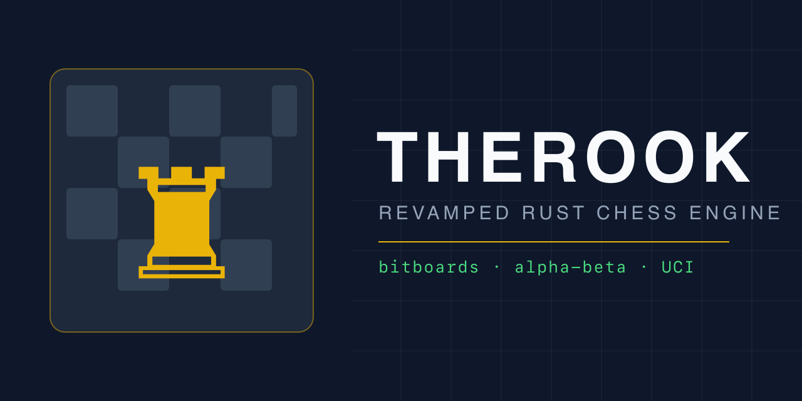

# Therook

Therook is a revamped Rust chess engine built on bitboards, with a
deterministic alpha-beta search over a standard UCI interface.

## Build

```bash
cargo build --release --manifest-path rs-therook/Cargo.toml
```

The binary speaks plain UCI (`uci`, `isready`, `ucinewgame`, `position`,
`go depth|movetime|wtime|btime|infinite`, `stop`, `quit`) and reports
`info depth score nodes time pv` plus `bestmove`, using `bestmove 0000`
with an `info string gameover checkmate|stalemate` marker in terminal
positions.